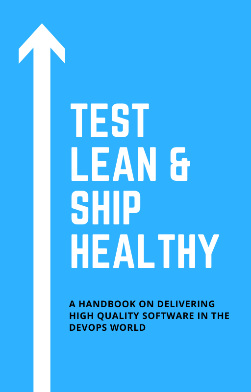

# Test Lean & Ship Healthy: A Handbook on Delivering High Quality Software in the DevOps World

Shipping code on time is key to delivering a successful software product. However, increasing velocity at the cost of quality ("move fast and break things") is unsustainable beyond a certain point, and a non-starter in domains where availability and correctness are paramount, such as an application security product.

In this book, we outline a strategy for keeping both velocity and quality high: employing a mix of testing strategies, building quality into the development and deployment proces, and automating as much as possible.

We cover a selection of tools and techniques for testing at all stages of the pipeline and discuss how we use them to deliver reliable software fast.

 

 This work is licensed under a <a rel="license" href="http://creativecommons.org/licenses/by-nc-nd/4.0/">Creative Commons Attribution-NonCommercial-NoDerivatives 4.0 International License</a>.
